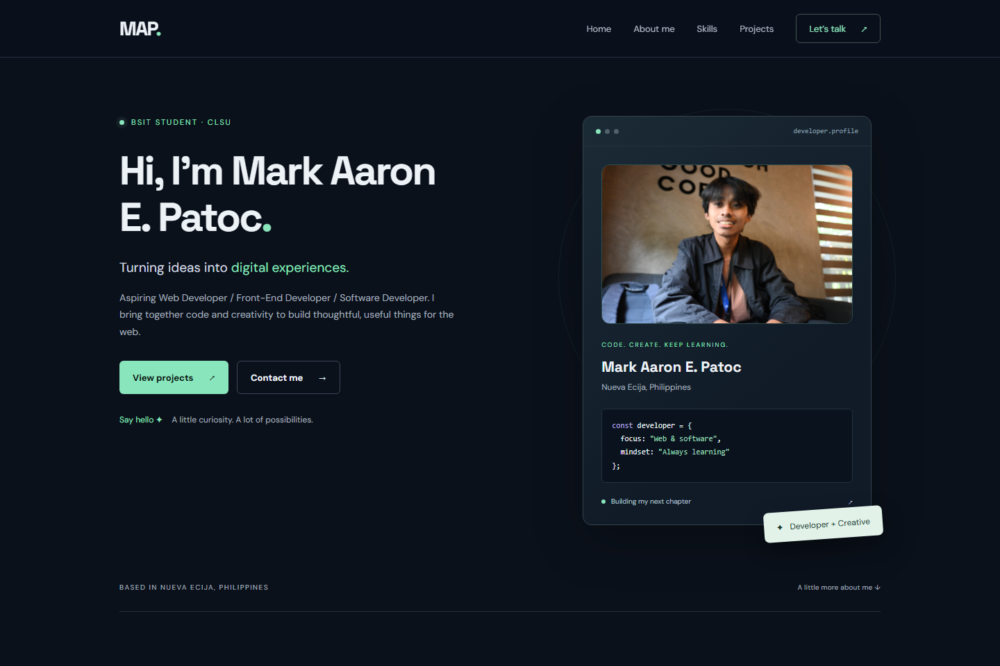
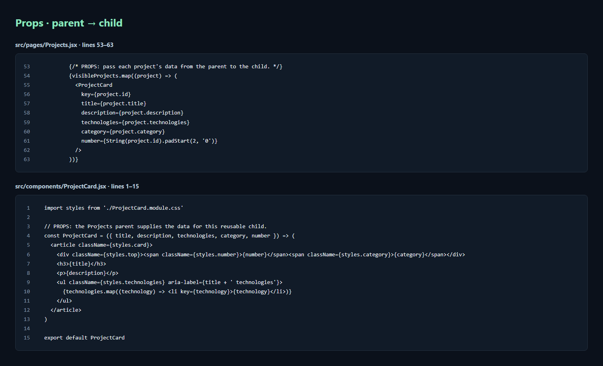
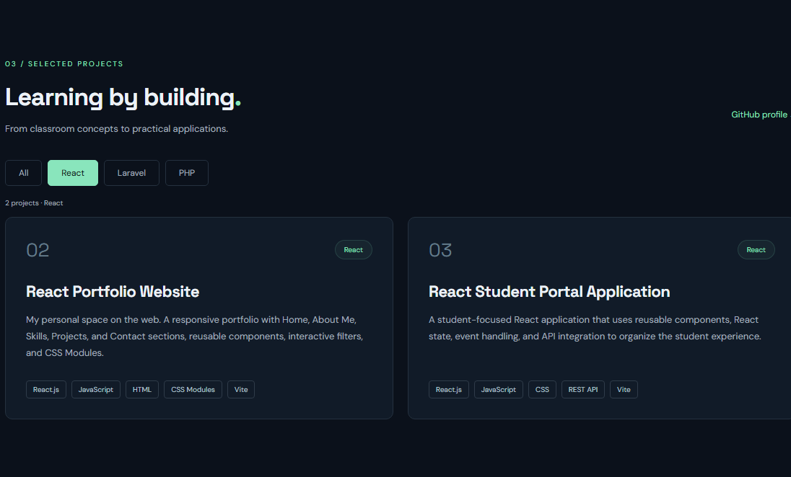
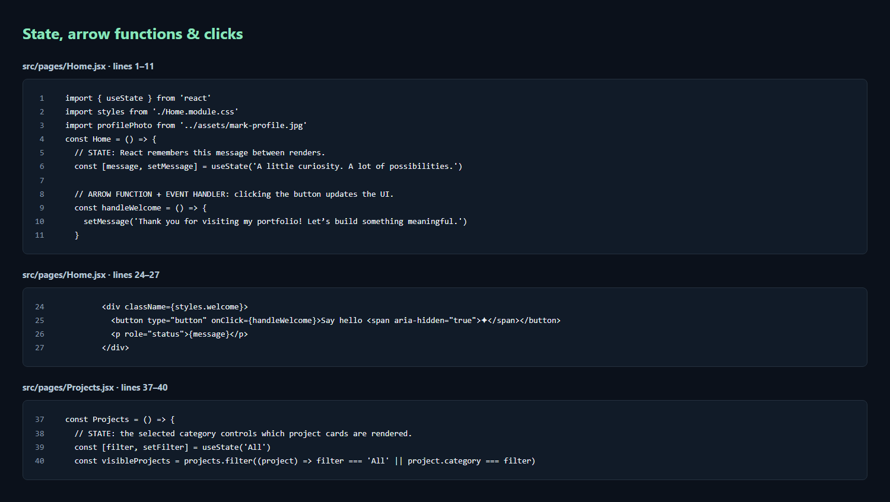
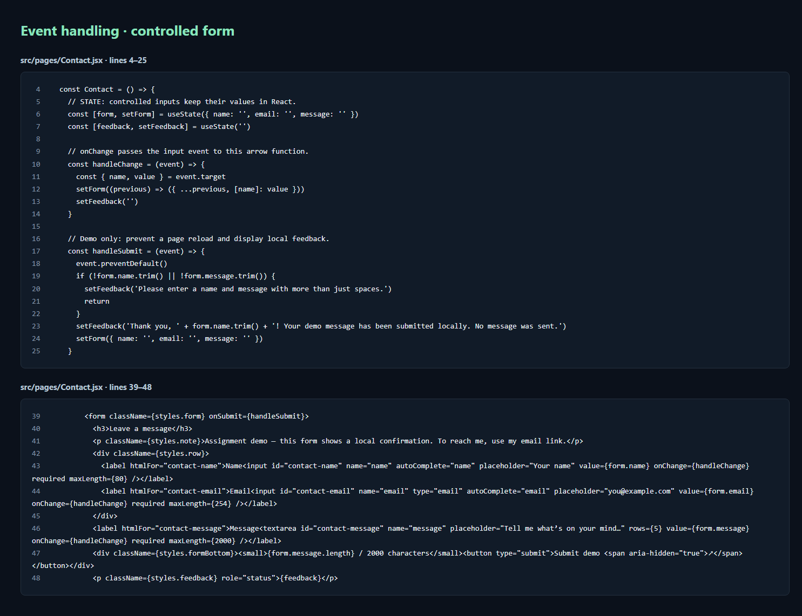
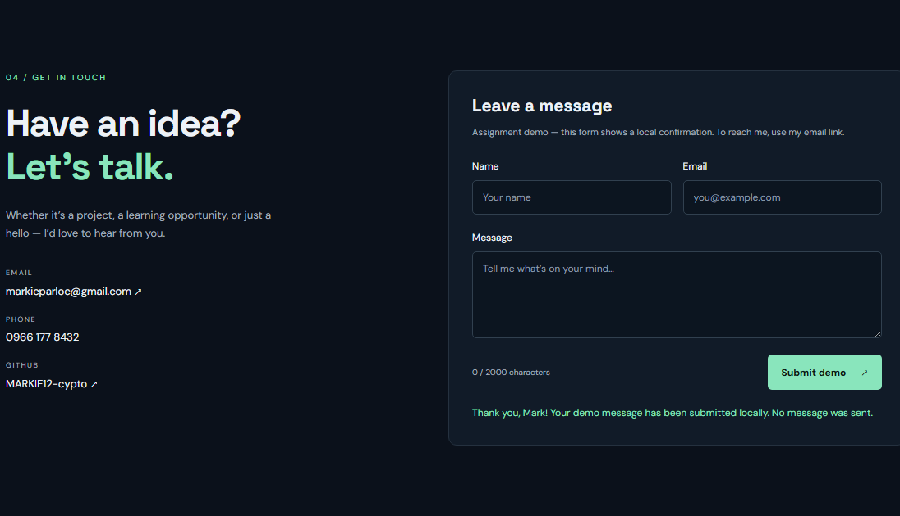
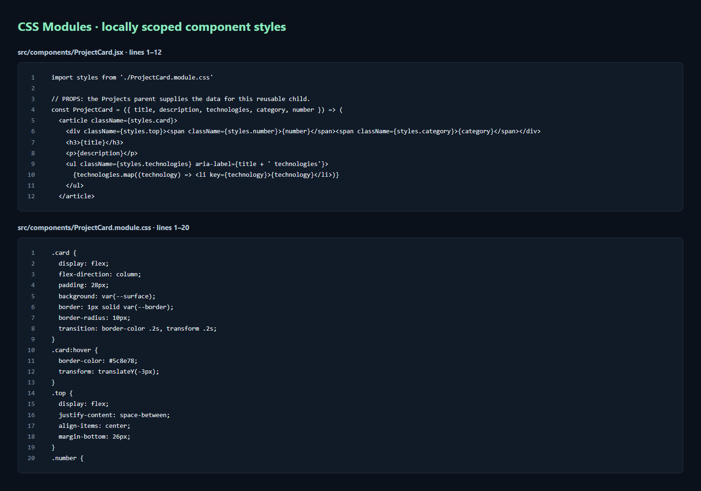

# Mark Aaron E. Patoc — React Portfolio Submission

A first React application using Vite, JavaScript, and CSS Modules.

# 1. Complete folder structure

The runnable source, configuration, and submission files are organized as follows. `node_modules/` is generated by installation and `dist/` by the production build; neither belongs in Git.


```text
my-resume-folder/
├── .gitignore
├── README.md
├── package.json
├── package-lock.json
├── index.html
├── vite.config.js
├── eslint.config.js
├── public/
│   ├── favicon.svg
│   └── icons.svg                  (unused Vite starter asset)
├── src/
│   ├── main.jsx
│   ├── index.css                  (reset, fonts, shared theme tokens)
│   ├── App.jsx
│   ├── App.module.css
│   ├── assets/
│   │   ├── mark-profile.jpg        (Home profile photo)
│   │   ├── mark-about.jpg          (About Me photo)
│   │   ├── hero.png
│   │   ├── react.svg
│   │   └── vite.svg
│   ├── components/
│   │   ├── Navbar.jsx
│   │   ├── Navbar.module.css
│   │   ├── ProjectCard.jsx
│   │   ├── ProjectCard.module.css
│   │   ├── SkillCard.jsx
│   │   └── SkillCard.module.css
│   └── pages/
│       ├── Home.jsx
│       ├── Home.module.css
│       ├── About.jsx
│       ├── About.module.css
│       ├── Skills.jsx
│       ├── Skills.module.css
│       ├── Projects.jsx
│       ├── Projects.module.css
│       ├── Contact.jsx
│       └── Contact.module.css
└── docs/
    ├── SUBMISSION.md               (this complete guide)
    ├── browser-checks.txt
    └── screenshots/                (16 captured PNG images)
```

# 2. Installation commands

Use Node.js 24 LTS and npm (the project was tested with Node 24.13.0). In a PowerShell terminal:


```powershell
cd C:\React\my-resume-folder
npm install
npm run dev
```

Open the local URL printed by Vite, normally http://localhost:5173. If that port is busy, use the URL Vite actually prints.

To verify and build:


```powershell
npm run lint
npm run build
npm run preview
```

For an exact dependency installation from the included lockfile, use `npm ci` instead of `npm install`. The only application dependencies are React and React DOM. No Bootstrap, Tailwind, router, or form library is needed. Tailwind appears only as a technology used by the separate SIEL SPACE project.

# 3. Complete source code for every required file

These are the complete runtime and configuration files from the working project. The generated [package-lock.json](../package-lock.json) is included in the repository; keep it for reproducible installs. The two required photo assets are included as [mark-profile.jpg](../src/assets/mark-profile.jpg) and [mark-about.jpg](../src/assets/mark-about.jpg). They are copies of the supplied photos, displayed using responsive CSS framing. Unused starter images and icons are not required by this application.

## package.json


```json
{
  "name": "my-resume-folder",
  "private": true,
  "version": "0.0.0",
  "type": "module",
  "scripts": {
    "dev": "vite",
    "build": "vite build",
    "lint": "eslint .",
    "preview": "vite preview"
  },
  "dependencies": {
    "react": "^19.2.8",
    "react-dom": "^19.2.8"
  },
  "devDependencies": {
    "@eslint/js": "^10.0.1",
    "@types/react": "^19.2.18",
    "@types/react-dom": "^19.2.4",
    "@vitejs/plugin-react": "^6.1.0",
    "eslint": "^10.9.0",
    "eslint-plugin-react-hooks": "^7.1.1",
    "eslint-plugin-react-refresh": "^0.5.4",
    "globals": "^17.11.0",
    "vite": "^8.2.2"
  }
}
```

## index.html


```html
<!doctype html>
<html lang="en">
  <head>
    <meta charset="UTF-8" />
    <link rel="icon" type="image/svg+xml" href="/favicon.svg" />
    <meta name="viewport" content="width=device-width, initial-scale=1.0" />
    <meta name="description" content="Mark Aaron E. Patoc — BSIT student at CLSU, aspiring web and software developer based in Nueva Ecija, Philippines." />
    <meta name="theme-color" content="#0b111b" />
    <title>Mark Aaron E. Patoc | Developer Portfolio</title>
  </head>
  <body>
    <div id="root"></div>
    <script type="module" src="/src/main.jsx"></script>
  </body>
</html>
```

## vite.config.js


```javascript
import react from '@vitejs/plugin-react'
import { defineConfig } from 'vite'

// https://vite.dev/config/
export default defineConfig({
  plugins: [react()],
})
```

## eslint.config.js


```javascript
import js from '@eslint/js'
import globals from 'globals'
import reactHooks from 'eslint-plugin-react-hooks'
import reactRefresh from 'eslint-plugin-react-refresh'
import { defineConfig, globalIgnores } from 'eslint/config'

export default defineConfig([
  globalIgnores(['dist']),
  {
    files: ['**/*.{js,jsx}'],
    extends: [
      js.configs.recommended,
      reactHooks.configs.flat.recommended,
      reactRefresh.configs.vite,
    ],
    languageOptions: {
      globals: globals.browser,
      parserOptions: { ecmaFeatures: { jsx: true } },
    },
  },
])
```

## .gitignore


```text
# Logs
logs
*.log
npm-debug.log*
yarn-debug.log*
yarn-error.log*
pnpm-debug.log*
lerna-debug.log*

node_modules
dist
dist-ssr
*.local

# Editor directories and files
.vscode/*
!.vscode/extensions.json
.idea
.DS_Store
*.suo
*.ntvs*
*.njsproj
*.sln
*.sw?
```

## public/favicon.svg


```html
<svg xmlns="http://www.w3.org/2000/svg" viewBox="0 0 64 64"><rect width="64" height="64" rx="14" fill="#111b28"/><text x="10" y="45" fill="#89e5bc" font-family="Arial,sans-serif" font-size="40" font-weight="700">M</text><circle cx="53" cy="44" r="4" fill="#89e5bc"/></svg>
```

## src/main.jsx


```jsx
import { StrictMode } from 'react'
import { createRoot } from 'react-dom/client'
import './index.css'
import App from './App.jsx'

createRoot(document.getElementById('root')).render(
  <StrictMode>
    <App />
  </StrictMode>,
)
```

## src/index.css


```css
@import url('https://fonts.googleapis.com/css2?family=DM+Sans:wght@400;500;600;700&family=Space+Grotesk:wght@400;500;600;700&display=swap');
:root {
  font-family: 'DM Sans', system-ui, sans-serif;
  color: #edf2f7;
  background: #0b111b;
  font-synthesis: none;
  text-rendering: optimizeLegibility;
  -webkit-font-smoothing: antialiased;
  color-scheme: dark;
  --accent: #89e5bc;
  --muted: #a3afbe;
  --border: #25313f;
  --surface: #111b28;
}
* {
  box-sizing: border-box;
}
html {
  scroll-behavior: smooth;
  scroll-padding-top: 100px;
}
body {
  margin: 0;
  min-width: 320px;
}
button, input, textarea {
  font: inherit;
}
button, a {
  -webkit-tap-highlight-color: transparent;
}
button {
  cursor: pointer;
}
a {
  color: inherit;
  text-decoration: none;
}
button, a, input, textarea {
  transition: background .2s, border-color .2s, color .2s;
}
:focus-visible {
  outline: 2px solid var(--accent);
  outline-offset: 5px;
}
::selection {
  color: #0b111b;
  background: var(--accent);
}
h1, h2, h3 {
  font-family: 'Space Grotesk', system-ui, sans-serif;
}
h1, h2, h3, p {
  margin-top: 0;
}
p {
  line-height: 1.75;
}
@media (prefers-reduced-motion: reduce) {
  html {
    scroll-behavior: auto;
  }
  *, *::before, *::after {
    transition: none !important;
  }
}
```

## src/App.jsx


```jsx
import Navbar from './components/Navbar'
import Home from './pages/Home'
import About from './pages/About'
import Skills from './pages/Skills'
import Projects from './pages/Projects'
import Contact from './pages/Contact'
import styles from './App.module.css'
import { useEffect, useRef } from 'react'

const App = () => {
  const mainRef = useRef(null)

  useEffect(() => {
    // Reveal each section once, when it enters the viewport.
    if (!('IntersectionObserver' in window)) return

    const sections = [...mainRef.current.children]
    const observer = new IntersectionObserver((entries) => {
      entries.forEach((entry) => {
        if (entry.isIntersecting) {
          entry.target.classList.add(styles.fadeIn)
          observer.unobserve(entry.target)
        }
      })
    }, { threshold: 0.08 })

    sections.forEach((section) => observer.observe(section))
    return () => {
      observer.disconnect()
      sections.forEach((section) => section.classList.remove(styles.fadeIn))
    }
  }, [])

  return (
  <>
    <a className={styles.skipLink} href="#main">Skip to content</a>
    <Navbar />
    <main id="main" className={styles.main} ref={mainRef}>
      <Home />
      <About />
      <Skills />
      <Projects />
      <Contact />
    </main>
    <footer className={styles.footer}>
      <a href="#home" className={styles.signature}>MAP<span>.</span></a>
      <p>© {new Date().getFullYear()} Mark Aaron E. Patoc. Built with React & a little curiosity.</p>
      <a href="#home">Back to top ↑</a>
    </footer>
  </>
  )
}

export default App
```

## src/App.module.css


```css
.main {
  max-width: 1160px;
  margin: auto;
  padding: 0 32px;
}
.fadeIn {
  animation: fadeIn 700ms ease-out both;
}
@keyframes fadeIn {
  from {
    opacity: 0;
    transform: translateY(18px);
  }
  to {
    opacity: 1;
    transform: translateY(0);
  }
}
/* Keep keyboard focus immediately visible, even during a reveal. */
.fadeIn:focus-within {
  animation: none;
}
@media (prefers-reduced-motion: reduce) {
  .fadeIn {
    animation: none;
  }
}
@media print {
  .fadeIn {
    animation: none;
  }
}
.footer {
  max-width: 1096px;
  margin: auto;
  padding: 30px 0;
  border-top: 1px solid var(--border);
  display: flex;
  align-items: center;
  justify-content: space-between;
  gap: 24px;
  font-size: 12px;
  color: var(--muted);
}
.footer p {
  margin: 0;
}
.signature {
  color: #edf2f7;
  font-size: 24px;
  font-weight: 700;
  letter-spacing: -1px;
}
.signature span {
  color: var(--accent);
}
.footer a:hover {
  color: var(--accent);
}
.skipLink {
  position: fixed;
  top: -100px;
  left: 20px;
  z-index: 100;
  padding: 12px;
  background: var(--accent);
  color: #0b111b;
}
.skipLink:focus {
  top: 10px;
}
@media (max-width: 700px) {
  .main {
    padding: 0 22px;
  }
  .footer {
    margin: 0 22px;
    flex-wrap: wrap;
  }
  .footer p {
    order: 3;
    width: 100%;
  }
}
```

## src/components/Navbar.jsx


```jsx
import { useState } from 'react'
import styles from './Navbar.module.css'

const Navbar = () => {
  const [isOpen, setIsOpen] = useState(false)
  const closeMenu = () => setIsOpen(false)

  return (
    <header className={styles.header}>
      <nav className={styles.nav} aria-label="Main navigation">
        <a href="#home" className={styles.logo} onClick={closeMenu} aria-label="Mark Aaron Patoc home">MAP<span>.</span></a>
        <button className={styles.menuButton} type="button" aria-expanded={isOpen} aria-controls="navigation-links" onClick={() => setIsOpen((previous) => !previous)}>
          {isOpen ? 'Close ✕' : 'Menu ☰'}
        </button>
        <div id="navigation-links" className={styles.links + (isOpen ? ' ' + styles.open : '')}>
          <a href="#home" onClick={closeMenu}>Home</a>
          <a href="#about" onClick={closeMenu}>About me</a>
          <a href="#skills" onClick={closeMenu}>Skills</a>
          <a href="#projects" onClick={closeMenu}>Projects</a>
          <a href="#contact" onClick={closeMenu} className={styles.contact}>Let’s talk <span aria-hidden="true">↗</span></a>
        </div>
      </nav>
    </header>
  )
}

export default Navbar
```

## src/components/Navbar.module.css


```css
.header {
  position: sticky;
  top: 0;
  z-index: 10;
  background: #0b111bf2;
  backdrop-filter: blur(16px);
  border-bottom: 1px solid var(--border);
}
.nav {
  max-width: 1160px;
  margin: auto;
  padding: 20px 32px;
  display: flex;
  align-items: center;
  justify-content: space-between;
}
.logo {
  font-family: 'Space Grotesk', sans-serif;
  font-size: 28px;
  font-weight: 700;
  letter-spacing: -1.5px;
}
.logo span {
  color: var(--accent);
}
.links {
  display: flex;
  align-items: center;
  gap: 32px;
  font-size: 13px;
  color: #b5bfcc;
}
.links a:hover {
  color: var(--accent);
}
.contact {
  border: 1px solid #42514e;
  padding: 11px 18px;
  border-radius: 6px;
  color: var(--accent);
}
.contact span {
  margin-left: 18px;
}
.menuButton {
  display: none;
  border: 1px solid var(--border);
  background: var(--surface);
  color: #edf2f7;
  padding: 9px 14px;
  border-radius: 5px;
}
@media (max-width: 700px) {
  .nav {
    padding: 16px 22px;
    flex-wrap: wrap;
  }
  .menuButton {
    display: block;
  }
  .links {
    display: none;
    width: 100%;
    padding: 24px 0 8px;
    align-items: stretch;
    gap: 20px;
  }
  .open {
    display: flex;
    flex-direction: column;
  }
}
```

## src/components/ProjectCard.jsx


```jsx
import styles from './ProjectCard.module.css'

// PROPS: the Projects parent supplies the data for this reusable child.
const ProjectCard = ({ title, description, technologies, category, number }) => (
  <article className={styles.card}>
    <div className={styles.top}><span className={styles.number}>{number}</span><span className={styles.category}>{category}</span></div>
    <h3>{title}</h3>
    <p>{description}</p>
    <ul className={styles.technologies} aria-label={title + ' technologies'}>
      {technologies.map((technology) => <li key={technology}>{technology}</li>)}
    </ul>
  </article>
)

export default ProjectCard
```

## src/components/ProjectCard.module.css


```css
.card {
  display: flex;
  flex-direction: column;
  padding: 28px;
  background: var(--surface);
  border: 1px solid var(--border);
  border-radius: 10px;
  transition: border-color .2s, transform .2s;
}
.card:hover {
  border-color: #5c8e78;
  transform: translateY(-3px);
}
.top {
  display: flex;
  justify-content: space-between;
  align-items: center;
  margin-bottom: 26px;
}
.number {
  font: 26px 'Space Grotesk', sans-serif;
  color: #637b89;
}
.category {
  color: var(--accent);
  background: #89e5bc0d;
  border: 1px solid #89e5bc26;
  padding: 6px 12px;
  border-radius: 20px;
  font-size: 10px;
}
.card h3 {
  font-size: 22px;
  line-height: 1.35;
  margin-bottom: 14px;
  letter-spacing: -.5px;
}
.card p {
  color: var(--muted);
  font-size: 13px;
  margin-bottom: 26px;
}
.technologies {
  margin: auto 0 0;
  padding: 0;
  list-style: none;
  display: flex;
  gap: 7px;
  flex-wrap: wrap;
}
.technologies li {
  border: 1px solid #2f3b49;
  color: #b5c3d0;
  padding: 5px 9px;
  font-size: 10px;
  border-radius: 4px;
}
```

## src/components/SkillCard.jsx


```jsx
import styles from './SkillCard.module.css'

// PROPS: each card receives its own name, category, and experience.
const SkillCard = ({ name, category, experience }) => (
  <article className={styles.card}>
    <span className={styles.symbol} aria-hidden="true">{name.slice(0, 2)}</span>
    <div><h3>{name}</h3><p>{category}</p></div>
    {experience && <span className={styles.experience}>{experience}</span>}
  </article>
)

export default SkillCard
```

## src/components/SkillCard.module.css


```css
.card {
  padding: 20px 16px;
  display: flex;
  align-items: center;
  gap: 12px;
  background: var(--surface);
  border: 1px solid var(--border);
  border-radius: 8px;
  transition: border-color .2s;
}
.card:hover {
  border-color: #5c8e78;
}
.symbol {
  background: #89e5bc0d;
  border: 1px solid #89e5bc24;
  color: var(--accent);
  width: 36px;
  height: 36px;
  display: grid;
  place-items: center;
  border-radius: 7px;
  font: 12px monospace;
  flex-shrink: 0;
}
.card h3 {
  font-size: 13px;
  margin: 0 0 5px;
}
.card p {
  font-size: 10px;
  color: var(--muted);
  margin: 0;
}
.experience {
  font-size: 9px;
  color: var(--accent);
  margin-left: auto;
  white-space: nowrap;
}
```

## src/pages/About.jsx


```jsx
import styles from './About.module.css'

const About = () => (
  <section id="about" className={styles.about} aria-labelledby="about-title">
    <div>
      <p className={styles.eyebrow}>01 / ABOUT ME</p>
      <h2 id="about-title">A developer’s mindset.<br /><span>A creative perspective.</span></h2>
      <p>I’m Mark, a Bachelor of Science in Information Technology student at Central Luzon State University. I’m interested in web and software development, and I enjoy turning everyday problems into practical applications.</p>
      <p>My experience includes PHP, MySQL, Laravel, Livewire, JavaScript, React, and Python. Beyond code, I explore video editing, photography, graphic design, and photo editing — bringing a visual perspective to the things I build.</p>
      <a href="https://github.com/MARKIE12-cypto" target="_blank" rel="noreferrer">Find me on GitHub ↗</a>
    </div>
    <aside className={styles.education}>
      <span className={styles.icon} aria-hidden="true">↗</span>
      <p className={styles.eyebrow}>CURRENTLY LEARNING AT</p>
      <h3>Central Luzon<br />State University</h3>
      <p>Bachelor of Science in<br />Information Technology</p>
      <div><span>Expected graduation</span><strong>2026–2027</strong></div>
      <small>Nueva Ecija, Philippines</small>
    </aside>
  </section>
)

export default About
```

## src/pages/About.module.css


```css
.about {
  padding: 86px 0;
  display: grid;
  grid-template-columns: 1.55fr 1fr;
  gap: 90px;
  border-bottom: 1px solid var(--border);
}
.eyebrow {
  color: var(--accent);
  font-size: 10px;
  letter-spacing: 2px;
  margin-bottom: 18px;
}
.about h2 {
  font-size: 33px;
  line-height: 1.3;
  letter-spacing: -1px;
  margin-bottom: 23px;
}
.about h2 span {
  color: #a3afbe;
}
.about p:not(.eyebrow) {
  color: var(--muted);
  font-size: 14px;
}
.about a {
  color: var(--accent);
  font-size: 13px;
  display: inline-block;
  margin-top: 8px;
}
.education {
  background: var(--surface);
  border: 1px solid var(--border);
  border-radius: 10px;
  padding: 28px;
  align-self: center;
}
.icon {
  display: block;
  color: var(--accent);
  font-size: 25px;
  margin-bottom: 24px;
}
.education .eyebrow {
  font-size: 9px;
}
.education h3 {
  font-size: 24px;
  line-height: 1.3;
  margin-bottom: 15px;
}
.education div {
  display: flex;
  justify-content: space-between;
  gap: 12px;
  border-top: 1px solid var(--border);
  padding-top: 20px;
  margin-top: 23px;
  font-size: 11px;
}
.education div span {
  color: var(--muted);
}
.education strong {
  color: var(--accent);
}
.education small {
  display: block;
  margin-top: 14px;
  color: var(--muted);
  font-size: 10px;
}
@media (max-width: 700px) {
  .about {
    grid-template-columns: 1fr;
    gap: 32px;
    padding: 60px 0;
  }
  .about h2 {
    font-size: 29px;
  }
}
```

## src/pages/Contact.jsx


```jsx
import { useState } from 'react'
import styles from './Contact.module.css'

const Contact = () => {
  // STATE: controlled inputs keep their values in React.
  const [form, setForm] = useState({ name: '', email: '', message: '' })
  const [feedback, setFeedback] = useState('')

  // onChange passes the input event to this arrow function.
  const handleChange = (event) => {
    const { name, value } = event.target
    setForm((previous) => ({ ...previous, [name]: value }))
    setFeedback('')
  }

  // Demo only: prevent a page reload and display local feedback.
  const handleSubmit = (event) => {
    event.preventDefault()
    if (!form.name.trim() || !form.message.trim()) {
      setFeedback('Please enter a name and message with more than just spaces.')
      return
    }
    setFeedback('Thank you, ' + form.name.trim() + '! Your demo message has been submitted locally. No message was sent.')
    setForm({ name: '', email: '', message: '' })
  }

  return (
    <section id="contact" className={styles.section} aria-labelledby="contact-title">
      <div className={styles.intro}>
        <p className={styles.eyebrow}>04 / GET IN TOUCH</p>
        <h2 id="contact-title">Have an idea?<br /><span>Let’s talk.</span></h2>
        <p>Whether it’s a project, a learning opportunity, or just a hello — I’d love to hear from you.</p>
        <dl className={styles.details}>
          <div><dt>EMAIL</dt><dd><a href="mailto:markieparloc@gmail.com">markieparloc@gmail.com ↗</a></dd></div>
          <div><dt>PHONE</dt><dd><a href="tel:+639661778432">0966 177 8432</a></dd></div>
          <div><dt>GITHUB</dt><dd><a href="https://github.com/MARKIE12-cypto" target="_blank" rel="noreferrer">MARKIE12-cypto ↗</a></dd></div>
        </dl>
      </div>
      <form className={styles.form} onSubmit={handleSubmit}>
        <h3>Leave a message</h3>
        <p className={styles.note}>Assignment demo — this form shows a local confirmation. To reach me, use my email link.</p>
        <div className={styles.row}>
          <label htmlFor="contact-name">Name<input id="contact-name" name="name" autoComplete="name" placeholder="Your name" value={form.name} onChange={handleChange} required maxLength={80} /></label>
          <label htmlFor="contact-email">Email<input id="contact-email" name="email" type="email" autoComplete="email" placeholder="you@example.com" value={form.email} onChange={handleChange} required maxLength={254} /></label>
        </div>
        <label htmlFor="contact-message">Message<textarea id="contact-message" name="message" placeholder="Tell me what’s on your mind…" rows={5} value={form.message} onChange={handleChange} required maxLength={2000} /></label>
        <div className={styles.formBottom}><small>{form.message.length} / 2000 characters</small><button type="submit">Submit demo <span aria-hidden="true">↗</span></button></div>
        <p className={styles.feedback} role="status">{feedback}</p>
      </form>
    </section>
  )
}

export default Contact
```

## src/pages/Contact.module.css


```css
.section {
  padding: 86px 0;
  display: grid;
  grid-template-columns: 1fr 1.2fr;
  gap: 75px;
}
.eyebrow {
  color: var(--accent);
  font-size: 10px;
  letter-spacing: 2px;
  margin-bottom: 20px;
}
.intro h2 {
  font-size: 46px;
  letter-spacing: -1.5px;
  line-height: 1.15;
  margin-bottom: 22px;
}
.intro h2 span {
  color: var(--accent);
}
.intro > p:not(.eyebrow) {
  color: var(--muted);
  font-size: 13px;
  max-width: 340px;
}
.details {
  margin: 30px 0 0;
}
.details div {
  margin-bottom: 20px;
}
.details dt {
  font-size: 9px;
  letter-spacing: 1.5px;
  color: var(--muted);
  margin-bottom: 7px;
}
.details dd {
  margin: 0;
  font-size: 13px;
}
.details a:hover {
  color: var(--accent);
}
.form {
  padding: 28px;
  background: var(--surface);
  border: 1px solid var(--border);
  border-radius: 10px;
}
.form h3 {
  font-size: 21px;
  margin-bottom: 10px;
}
.note {
  color: var(--muted);
  font-size: 11px;
  margin-bottom: 24px;
}
.row {
  display: grid;
  grid-template-columns: 1fr 1fr;
  gap: 14px;
}
.form label {
  display: flex;
  flex-direction: column;
  font-size: 12px;
  gap: 9px;
  margin-bottom: 20px;
}
.form input, .form textarea {
  min-width: 0;
  width: 100%;
  background: #0c1520;
  border: 1px solid #31404f;
  border-radius: 5px;
  padding: 12px;
  font-size: 12px;
  color: #edf2f7;
}
.form textarea {
  resize: vertical;
}
.form input::placeholder, .form textarea::placeholder {
  color: #8d9caa;
}
.formBottom {
  display: flex;
  justify-content: space-between;
  align-items: center;
  gap: 12px;
}
.formBottom small {
  font-size: 10px;
  color: var(--muted);
}
.form button {
  border: 0;
  border-radius: 5px;
  color: #0b1913;
  background: var(--accent);
  padding: 13px 17px;
  font-size: 12px;
  font-weight: 700;
}
.form button:hover {
  background: #b0f6d5;
}
.form button span {
  margin-left: 15px;
}
.feedback {
  color: var(--accent);
  font-size: 12px;
  margin: 18px 0 0;
}
.feedback:empty {
  display: none;
}
@media (max-width: 850px) {
  .section {
    gap: 35px;
  }
  .row {
    grid-template-columns: 1fr;
    gap: 0;
  }
}
@media (max-width: 700px) {
  .section {
    padding: 60px 0;
    grid-template-columns: 1fr;
  }
  .intro h2 {
    font-size: 38px;
  }
  .form {
    padding: 22px;
  }
}
```

## src/pages/Home.jsx


```jsx
import { useState } from 'react'
import styles from './Home.module.css'
import profilePhoto from '../assets/mark-profile.jpg'
const Home = () => {
  // STATE: React remembers this message between renders.
  const [message, setMessage] = useState('A little curiosity. A lot of possibilities.')

  // ARROW FUNCTION + EVENT HANDLER: clicking the button updates the UI.
  const handleWelcome = () => {
    setMessage('Thank you for visiting my portfolio! Let’s build something meaningful.')
  }

  return (
    <section id="home" className={styles.home} aria-labelledby="home-title">
      <div className={styles.intro}>
        <p className={styles.eyebrow}><span /> BSIT STUDENT · CLSU</p>
        <h1 id="home-title">Hi, I’m Mark Aaron<span className={styles.name}>E. Patoc<span className={styles.dot}>.</span></span></h1>
        <p className={styles.role}>Turning ideas into <span>digital experiences.</span></p>
        <p className={styles.description}>Aspiring Web Developer / Front-End Developer / Software Developer. I bring together code and creativity to build thoughtful, useful things for the web.</p>
        <div className={styles.actions}>
          <a href="#projects" className={styles.primary}>View projects <span aria-hidden="true">↗</span></a>
          <a href="#contact" className={styles.secondary}>Contact me <span aria-hidden="true">→</span></a>
        </div>
        <div className={styles.welcome}>
          <button type="button" onClick={handleWelcome}>Say hello <span aria-hidden="true">✦</span></button>
          <p role="status">{message}</p>
        </div>
      </div>
      <div className={styles.visual} aria-label="Developer profile card">
        <div className={styles.orbit} aria-hidden="true" />
        <div className={styles.profile}>
          <div className={styles.windowBar}><span /><span /><span /><small>developer.profile</small></div>
          <div className={styles.profileContent}>
            
            <p className={styles.profileLabel}>CODE. CREATE. KEEP LEARNING.</p>
            <h2>Mark Aaron E. Patoc</h2>
            <p className={styles.location}>Nueva Ecija, Philippines</p>
            <div className={styles.code}><p><span>const</span> developer = {'{'}</p><p>  focus: <em>"Web & software"</em>,</p><p>  mindset: <em>"Always learning"</em></p><p>{'};'}</p></div>
            <div className={styles.profileBottom}><span><b /> Building my next chapter</span><span>↗</span></div>
          </div>
        </div>
        <span className={styles.floatingTag}>✦ &nbsp; Developer + Creative</span>
      </div>
      <div className={styles.bottomLine}><span>BASED IN NUEVA ECIJA, PHILIPPINES</span><a href="#about">A little more about me ↓</a></div>
    </section>
  )
}

export default Home
```

## src/pages/Home.module.css


```css
.home {
  padding: 84px 0 0;
  display: grid;
  grid-template-columns: 1.35fr 1fr;
  gap: 35px 58px;
}
.profilePhoto {
  display: block;
  width: 100%;
  height: 230px;
  object-fit: cover;
  object-position: 50% 30%;
  border: 1px solid #89e5bc35;
  border-radius: 12px;
  margin-bottom: 23px;
}
.eyebrow {
  font-size: 11px;
  letter-spacing: 2px;
  color: var(--accent);
  display: flex;
  align-items: center;
  gap: 10px;
  margin-bottom: 27px;
}
.eyebrow span {
  width: 7px;
  height: 7px;
  background: var(--accent);
  border-radius: 50%;
  box-shadow: 0 0 0 5px #89e5bc12;
}
.intro h1 {
  font-size: clamp(40px, 4.4vw, 58px);
  line-height: 1.15;
  letter-spacing: -2.4px;
  margin-bottom: 22px;
}
.name {
  display: block;
}
.dot {
  color: var(--accent);
}
.role {
  font-size: 19px;
  color: #d1d9e2;
  margin-bottom: 15px;
}
.role span {
  color: var(--accent);
}
.description {
  color: var(--muted);
  max-width: 490px;
  font-size: 14px;
}
.actions {
  display: flex;
  gap: 12px;
  margin: 30px 0 24px;
}
.actions a {
  padding: 14px 19px;
  border-radius: 6px;
  font-size: 13px;
  font-weight: 700;
  display: flex;
  gap: 22px;
  align-items: center;
}
.primary {
  background: var(--accent);
  color: #0b1913;
}
.primary:hover {
  background: #b0f6d5;
}
.secondary {
  border: 1px solid #3a4755;
}
.secondary:hover {
  background: var(--surface);
}
.welcome {
  display: flex;
  align-items: flex-start;
  gap: 13px;
  min-height: 64px;
}
.welcome button {
  flex-shrink: 0;
  background: none;
  border: 0;
  padding: 4px 0;
  color: var(--accent);
  font-size: 12px;
}
.welcome p {
  font-size: 12px;
  color: var(--muted);
  margin: 3px 0 0;
  max-width: 310px;
}
.visual {
  position: relative;
  align-self: center;
  padding: 0 13px 20px;
}
.orbit {
  position: absolute;
  width: 110%;
  aspect-ratio: 1;
  top: -10px;
  left: -5%;
  border: 1px solid #89e5bc12;
  border-radius: 50%;
  background: radial-gradient(circle, #89e5bc0b, transparent 70%);
}
.profile {
  position: relative;
  border: 1px solid #34414a;
  border-radius: 13px;
  background: linear-gradient(140deg, #1b2b36, #111b28 65%);
  overflow: hidden;
  box-shadow: 0 22px 70px #0004;
}
.windowBar {
  display: flex;
  gap: 6px;
  padding: 15px 18px;
  border-bottom: 1px solid var(--border);
  align-items: center;
}
.windowBar > span {
  width: 7px;
  height: 7px;
  border-radius: 50%;
  background: #52606a;
}
.windowBar > span:first-child {
  background: #89e5bc;
}
.windowBar small {
  margin-left: auto;
  font-family: monospace;
  font-size: 10px;
  color: #90a1b0;
}
.profileContent {
  padding: 26px;
}
.monogram {
  position: relative;
  background: #89e5bc12;
  border: 1px solid #89e5bc35;
  width: 100px;
  height: 100px;
  margin-bottom: 23px;
  border-radius: 22px;
  display: flex;
  justify-content: center;
  align-items: center;
  font: 700 58px 'Space Grotesk', sans-serif;
}
.monogram > span {
  color: var(--accent);
}
.monogram i {
  position: absolute;
  bottom: -7px;
  right: -13px;
  font: normal 14px monospace;
  padding: 8px;
  background: #234237;
  color: #b0f6d5;
  border: 1px solid #426553;
  border-radius: 8px;
}
.profileLabel {
  font-size: 9px;
  letter-spacing: 1.8px;
  color: var(--accent);
  margin-bottom: 9px;
}
.profile h2 {
  font-size: 21px;
  margin-bottom: 6px;
}
.location {
  color: var(--muted);
  font-size: 12px;
}
.code {
  background: #0a131d;
  border: 1px solid #23313c;
  border-radius: 6px;
  padding: 14px;
  font: 11px/1.9 Consolas, monospace;
  margin: 20px 0;
}
.code p {
  white-space: pre-wrap;
  margin: 0;
}
.code span {
  color: #b5a3ef;
}
.code em {
  font-style: normal;
  color: #9cdbbc;
}
.profileBottom {
  display: flex;
  justify-content: space-between;
  font-size: 10px;
  color: #b0c0cd;
}
.profileBottom b {
  display: inline-block;
  width: 6px;
  height: 6px;
  background: var(--accent);
  border-radius: 50%;
  margin-right: 5px;
}
.floatingTag {
  position: absolute;
  bottom: 0;
  right: -3px;
  background: #e2f2e9;
  color: #183528;
  padding: 13px 18px;
  border-radius: 7px;
  font-size: 12px;
  transform: rotate(-4deg);
  box-shadow: 0 10px 30px #0005;
}
.bottomLine {
  grid-column: 1 / -1;
  border-bottom: 1px solid var(--border);
  padding: 28px 0;
  display: flex;
  justify-content: space-between;
  color: var(--muted);
  font-size: 10px;
  letter-spacing: 1.5px;
}
.bottomLine a {
  letter-spacing: .2px;
}
@media (max-width: 850px) {
  .home {
    gap: 30px;
  }
  .profileContent {
    padding: 20px;
  }
  .intro h1 {
    font-size: 44px;
  }
}
@media (max-width: 700px) {
  .home {
    grid-template-columns: 1fr;
    padding-top: 52px;
    gap: 30px;
  }
  .intro h1 {
    font-size: 44px;
  }
  .visual {
    width: 100%;
    max-width: 420px;
    margin: auto;
  }
  .bottomLine {
    gap: 20px;
    font-size: 9px;
  }
  .welcome {
    min-height: 55px;
  }
}
```

## src/pages/Projects.jsx


```jsx
import { useState } from 'react'
import ProjectCard from '../components/ProjectCard'
import styles from './Projects.module.css'

const projects = [
  {
    id: 1,
    title: 'SIEL SPACE — Facility Reservation and Monitoring System',
    description: 'A web-based system for managing university facilities, with role-based access for Super Administrators, Office Administrators, and External Users. Features include reservations, scheduling, amenities, notifications, feedback, and administration.',
    technologies: ['Laravel', 'PHP', 'Livewire', 'MySQL', 'Tailwind CSS', 'JavaScript', 'Git'],
    category: 'Laravel',
  },
  {
    id: 2,
    title: 'React Portfolio Website',
    description: 'My personal space on the web. A responsive portfolio with Home, About Me, Skills, Projects, and Contact sections, reusable components, interactive filters, and CSS Modules.',
    technologies: ['React.js', 'JavaScript', 'HTML', 'CSS Modules', 'Vite'],
    category: 'React',
  },
  {
    id: 3,
    title: 'React Student Portal Application',
    description: 'A student-focused React application that uses reusable components, React state, event handling, and API integration to organize the student experience.',
    technologies: ['React.js', 'JavaScript', 'CSS', 'REST API', 'Vite'],
    category: 'React',
  },
  {
    id: 4,
    title: 'Web-Based Database Applications',
    description: 'Database-driven applications with create, read, update, and delete (CRUD) functionality, forms, validation, and relational databases.',
    technologies: ['PHP', 'MySQL', 'HTML', 'CSS', 'JavaScript'],
    category: 'PHP',
  },
]
const filters = ['All', 'React', 'Laravel', 'PHP']

const Projects = () => {
  // STATE: the selected category controls which project cards are rendered.
  const [filter, setFilter] = useState('All')
  const visibleProjects = projects.filter((project) => filter === 'All' || project.category === filter)

  return (
    <section id="projects" className={styles.section} aria-labelledby="projects-title">
      <p className={styles.eyebrow}>03 / SELECTED PROJECTS</p>
      <div className={styles.heading}><div><h2 id="projects-title">Learning by building<span>.</span></h2><p>From classroom concepts to practical applications.</p></div><a href="https://github.com/MARKIE12-cypto" target="_blank" rel="noreferrer">GitHub profile ↗</a></div>
      <div className={styles.filters} role="group" aria-label="Filter projects">
        {filters.map((item) => (
          <button key={item} type="button" aria-pressed={filter === item} className={filter === item ? styles.active : ''} onClick={() => setFilter(item)}>{item}</button>
        ))}
      </div>
      <p className={styles.count} role="status">{visibleProjects.length} {visibleProjects.length === 1 ? 'project' : 'projects'} · {filter}</p>
      <div className={styles.grid}>
        {/* PROPS: pass each project's data from the parent to the child. */}
        {visibleProjects.map((project) => (
          <ProjectCard
            key={project.id}
            title={project.title}
            description={project.description}
            technologies={project.technologies}
            category={project.category}
            number={String(project.id).padStart(2, '0')}
          />
        ))}
      </div>
    </section>
  )
}

export default Projects
```

## src/pages/Projects.module.css


```css
.section {
  padding: 80px 0;
  border-bottom: 1px solid var(--border);
}
.eyebrow {
  color: var(--accent);
  font-size: 10px;
  letter-spacing: 2px;
  margin-bottom: 16px;
}
.heading {
  display: flex;
  align-items: center;
  justify-content: space-between;
  gap: 20px;
}
.heading h2 {
  font-size: 34px;
  letter-spacing: -1px;
  margin-bottom: 12px;
}
.heading h2 span {
  color: var(--accent);
}
.heading p {
  color: var(--muted);
  font-size: 13px;
}
.heading a {
  font-size: 12px;
  color: var(--accent);
  white-space: nowrap;
}
.filters {
  display: flex;
  gap: 8px;
  margin: 18px 0 15px;
  flex-wrap: wrap;
}
.filters button {
  border: 1px solid var(--border);
  border-radius: 5px;
  color: var(--muted);
  background: transparent;
  padding: 9px 18px;
  font-size: 12px;
}
.filters button:hover {
  border-color: #658571;
}
.filters button.active {
  background: var(--accent);
  border-color: var(--accent);
  color: #0b1913;
}
.count {
  color: var(--muted);
  font-size: 10px;
}
.grid {
  display: grid;
  grid-template-columns: 1fr 1fr;
  gap: 20px;
}
@media (max-width: 700px) {
  .section {
    padding: 60px 0;
  }
  .heading {
    display: block;
  }
  .heading h2 {
    font-size: 29px;
  }
  .grid {
    grid-template-columns: 1fr;
  }
}
```

## src/pages/Skills.jsx


```jsx
import { useState } from 'react'
import SkillCard from '../components/SkillCard'
import styles from './Skills.module.css'

const skills = [
  { name: 'HTML', category: 'Front-End', group: 'Web Development' },
  { name: 'CSS', category: 'Front-End', group: 'Web Development' },
  { name: 'JavaScript', category: 'Front-End', group: 'Web Development' },
  { name: 'React.js', category: 'Front-End', group: 'Web Development' },
  { name: 'PHP', category: 'Back-End', group: 'Web Development', experience: '2 years' },
  { name: 'Laravel', category: 'Back-End', group: 'Web Development', experience: '6 months' },
  { name: 'Livewire', category: 'Back-End', group: 'Web Development', experience: '6 months' },
  { name: 'MySQL', category: 'Database', group: 'Web Development', experience: '2 years' },
  { name: 'Python', category: 'Programming', group: 'Programming', experience: '1 year' },
  { name: 'Git / GitHub', category: 'Tools', group: 'Tools' },
  { name: 'Video Editing', category: 'Creative Skills', group: 'Creative' },
  { name: 'Photography', category: 'Creative Skills', group: 'Creative' },
  { name: 'Graphic Design', category: 'Creative Skills', group: 'Creative' },
  { name: 'Photo Editing', category: 'Creative Skills', group: 'Creative' },
]
const categories = ['All', 'Web Development', 'Programming', 'Tools', 'Creative']

const Skills = () => {
  const [category, setCategory] = useState('All')
  const visibleSkills = skills.filter((skill) => category === 'All' || skill.group === category)

  return (
    <section id="skills" className={styles.section} aria-labelledby="skills-title">
      <p className={styles.eyebrow}>02 / MY TOOLKIT</p>
      <div className={styles.heading}><h2 id="skills-title">The skills behind the work<span>.</span></h2><p>A mix of logic, design, and hands-on learning.</p></div>
      <div className={styles.filters} role="group" aria-label="Filter skills">
        {categories.map((item) => (
          <button key={item} type="button" aria-pressed={category === item} className={category === item ? styles.active : ''} onClick={() => setCategory(item)}>{item}</button>
        ))}
      </div>
      <p className={styles.count} role="status">{visibleSkills.length} skills · {category}</p>
      <div className={styles.grid}>
        {visibleSkills.map((skill) => <SkillCard key={skill.name} name={skill.name} category={skill.category} experience={skill.experience} />)}
      </div>
    </section>
  )
}

export default Skills
```

## src/pages/Skills.module.css


```css
.section {
  padding: 80px 0;
  border-bottom: 1px solid var(--border);
}
.eyebrow {
  color: var(--accent);
  font-size: 10px;
  letter-spacing: 2px;
  margin-bottom: 16px;
}
.heading {
  display: flex;
  justify-content: space-between;
  gap: 25px;
  align-items: baseline;
}
.heading h2 {
  font-size: 32px;
  letter-spacing: -1px;
}
.heading h2 span {
  color: var(--accent);
}
.heading p {
  color: var(--muted);
  font-size: 12px;
}
.filters {
  display: flex;
  flex-wrap: wrap;
  gap: 8px;
  margin: 8px 0 16px;
}
.filters button {
  border: 1px solid var(--border);
  border-radius: 5px;
  color: var(--muted);
  background: transparent;
  padding: 9px 16px;
  font-size: 12px;
}
.filters button:hover {
  border-color: #658571;
}
.filters button.active {
  background: var(--accent);
  border-color: var(--accent);
  color: #0b1913;
}
.count {
  font-size: 10px;
  color: var(--muted);
  margin-bottom: 16px;
}
.grid {
  display: grid;
  grid-template-columns: repeat(3, 1fr);
  gap: 12px;
}
@media (max-width: 850px) {
  .heading {
    display: block;
  }
  .grid {
    grid-template-columns: repeat(2, 1fr);
  }
}
@media (max-width: 500px) {
  .section {
    padding: 60px 0;
  }
  .heading h2 {
    font-size: 29px;
  }
  .grid {
    grid-template-columns: 1fr;
  }
}
```

# 4. How the application works

The entry file, `main.jsx`, mounts `App` inside React Strict Mode. `App` renders the navigation, five page sections, and footer. This is a single-page portfolio: navigation links scroll to section IDs, so a routing dependency is unnecessary.

- **Home:** introduces Mark and provides Projects and Contact links. Clicking **Say hello** changes a welcome message.
- **About:** shows the supplied professional background, CLSU education, and expected graduation.
- **Skills:** stores 14 skills in an array, filters them by group, and passes each skill to `SkillCard`. Each card also displays its more specific category, such as Front-End or Database.
- **Projects:** stores the four supplied project descriptions in an array. Filters select each project’s primary category (All = 4, React = 2, Laravel = 1, PHP = 1), then `.map()` renders `ProjectCard` children. Laravel is the primary category of SIEL SPACE even though it also uses PHP.
- **Contact:** keeps name, email, and message in React state. Typing updates controlled inputs and the live character count. Required fields and email validation are handled by the browser; whitespace-only names/messages are rejected by the submit handler. A valid submission shows a local confirmation and clears the inputs.
- **Mobile navigation:** a state-controlled menu opens and closes; selecting a link closes it.

This contact form is an assignment demonstration. It does not make a network request, send an email, store messages, or connect to a backend. The email link opens the visitor’s mail application. State is held in memory and returns to its initial values after a page reload. The other projects are portfolio descriptions provided by the student, not additional applications implemented inside this portfolio.

Every main component has its own CSS Module. The global stylesheet only defines fonts, theme variables, resets, accessibility defaults, and reduced-motion behavior. Google Fonts are optional: system fonts are used if those requests are unavailable.

**Verification:** production build and ESLint passed. Browser checks covered all filters, message updates, form validation and reset, mobile menu behavior, horizontal overflow at 320px and 390px, and JavaScript exceptions. See [browser-checks.txt](browser-checks.txt).



*Figure 1. The running portfolio with navigation, introduction, and call-to-action buttons.*

# 5. REACT CONCEPT DOCUMENTATION

## Props

**File:** `src/pages/Projects.jsx`, lines 53–63.

```jsx
        {/* PROPS: pass each project's data from the parent to the child. */}
        {visibleProjects.map((project) => (
          <ProjectCard
            key={project.id}
            title={project.title}
            description={project.description}
            technologies={project.technologies}
            category={project.category}
            number={String(project.id).padStart(2, '0')}
          />
        ))}
```

The `Projects` parent maps the filtered array into child components. Each JSX attribute passes one piece of data; `key` helps React identify list items and is not a normal child prop.

**File:** `src/components/ProjectCard.jsx`, lines 1–15.

```jsx
import styles from './ProjectCard.module.css'

// PROPS: the Projects parent supplies the data for this reusable child.
const ProjectCard = ({ title, description, technologies, category, number }) => (
  <article className={styles.card}>
    <div className={styles.top}><span className={styles.number}>{number}</span><span className={styles.category}>{category}</span></div>
    <h3>{title}</h3>
    <p>{description}</p>
    <ul className={styles.technologies} aria-label={title + ' technologies'}>
      {technologies.map((technology) => <li key={technology}>{technology}</li>)}
    </ul>
  </article>
)

export default ProjectCard
```

The `ProjectCard` child receives and destructures the props, then displays the title, description, category, number, and technologies. The same component renders different information for each project. `SkillCard.jsx` demonstrates the same pattern with skill information.

**Screenshot:** show the parent’s `.map()` and `<ProjectCard ... />` beside the child’s destructured parameters and rendered values. Also capture the Projects section with all four cards.



## State

### Example 1: welcome message

**File:** `src/pages/Home.jsx`, lines 1–11.

```jsx
import { useState } from 'react'
import styles from './Home.module.css'
import profilePhoto from '../assets/mark-profile.jpg'
const Home = () => {
  // STATE: React remembers this message between renders.
  const [message, setMessage] = useState('A little curiosity. A lot of possibilities.')

  // ARROW FUNCTION + EVENT HANDLER: clicking the button updates the UI.
  const handleWelcome = () => {
    setMessage('Thank you for visiting my portfolio! Let’s build something meaningful.')
  }
```
**File:** `src/pages/Home.jsx`, lines 24–27.

```jsx
        <div className={styles.welcome}>
          <button type="button" onClick={handleWelcome}>Say hello <span aria-hidden="true">✦</span></button>
          <p role="status">{message}</p>
        </div>
```

`message` holds the current text and `setMessage` updates it. Clicking **Say hello** runs `handleWelcome`; React renders the new text inside the status paragraph.

**Screenshot:** capture the state declaration, the handler, and the button with the status paragraph. Take before/after Home screenshots to show the changed message.


### Example 2: project filter

**File:** `src/pages/Projects.jsx`, lines 37–40.

```jsx
const Projects = () => {
  // STATE: the selected category controls which project cards are rendered.
  const [filter, setFilter] = useState('All')
  const visibleProjects = projects.filter((project) => filter === 'All' || project.category === filter)
```
**File:** `src/pages/Projects.jsx`, lines 46–49.

```jsx
      <div className={styles.filters} role="group" aria-label="Filter projects">
        {filters.map((item) => (
          <button key={item} type="button" aria-pressed={filter === item} className={filter === item ? styles.active : ''} onClick={() => setFilter(item)}>{item}</button>
        ))}
```

`filter` starts as All. Clicking a filter button calls `setFilter(item)`, recomputes `visibleProjects`, and changes the displayed cards and active button. The Skills section uses the same beginner-friendly pattern with `category` and `setCategory`.

**Screenshot:** show these state/filter lines and capture the Projects section with **React** selected and exactly two cards visible.



### Example 3: form state

**File:** `src/pages/Contact.jsx`, lines 4–14.

```jsx
const Contact = () => {
  // STATE: controlled inputs keep their values in React.
  const [form, setForm] = useState({ name: '', email: '', message: '' })
  const [feedback, setFeedback] = useState('')

  // onChange passes the input event to this arrow function.
  const handleChange = (event) => {
    const { name, value } = event.target
    setForm((previous) => ({ ...previous, [name]: value }))
    setFeedback('')
  }
```

The `form` object holds the input values. The functional update copies the previous fields and changes only the property matching the input’s `name`. `feedback` is a second state value for validation or confirmation text.

**Screenshot:** show both declarations and `handleChange`, then capture the form with values and its live character count.

## Arrow Functions

**File:** `src/pages/Home.jsx`, lines 4–11.

```jsx
const Home = () => {
  // STATE: React remembers this message between renders.
  const [message, setMessage] = useState('A little curiosity. A lot of possibilities.')

  // ARROW FUNCTION + EVENT HANDLER: clicking the button updates the UI.
  const handleWelcome = () => {
    setMessage('Thank you for visiting my portfolio! Let’s build something meaningful.')
  }
```

Both `Home` and `handleWelcome` use arrow function syntax (`() => {}`). The component returns JSX, while the event handler updates state. Array callbacks in `.map()` and `.filter()` also use arrow functions.

**Screenshot:** keep `const Home = () => {` and `const handleWelcome = () => {` visible together.



## Event Handling

### onClick — welcome button and project filters

**File:** `src/pages/Home.jsx`, lines 24–27.

```jsx
        <div className={styles.welcome}>
          <button type="button" onClick={handleWelcome}>Say hello <span aria-hidden="true">✦</span></button>
          <p role="status">{message}</p>
        </div>
```
**File:** `src/pages/Projects.jsx`, lines 46–49.

```jsx
      <div className={styles.filters} role="group" aria-label="Filter projects">
        {filters.map((item) => (
          <button key={item} type="button" aria-pressed={filter === item} className={filter === item ? styles.active : ''} onClick={() => setFilter(item)}>{item}</button>
        ))}
```

The welcome button passes the handler to `onClick` so it runs when clicked. Filter buttons use an inline arrow function to pass the selected category to the state setter. Both interactions visibly change the application.

**Screenshot:** show each `onClick` attribute and its handler/state setter; capture the updated welcome text or active project filter.

### onChange — controlled form fields

**File:** `src/pages/Contact.jsx`, lines 9–14.

```jsx
  // onChange passes the input event to this arrow function.
  const handleChange = (event) => {
    const { name, value } = event.target
    setForm((previous) => ({ ...previous, [name]: value }))
    setFeedback('')
  }
```
**File:** `src/pages/Contact.jsx`, lines 42–46.

```jsx
        <div className={styles.row}>
          <label htmlFor="contact-name">Name<input id="contact-name" name="name" autoComplete="name" placeholder="Your name" value={form.name} onChange={handleChange} required maxLength={80} /></label>
          <label htmlFor="contact-email">Email<input id="contact-email" name="email" type="email" autoComplete="email" placeholder="you@example.com" value={form.email} onChange={handleChange} required maxLength={254} /></label>
        </div>
        <label htmlFor="contact-message">Message<textarea id="contact-message" name="message" placeholder="Tell me what’s on your mind…" rows={5} value={form.message} onChange={handleChange} required maxLength={2000} /></label>
```

Each field reads its value from `form` and calls `handleChange` when edited. The event provides the input name and new value, which update state. Typing in Message also updates the displayed character count.

**Screenshot:** show `handleChange`, the input’s `value` and `onChange` attributes, and a filled form.

### onSubmit — local demo confirmation

**File:** `src/pages/Contact.jsx`, lines 16–25.

```jsx
  // Demo only: prevent a page reload and display local feedback.
  const handleSubmit = (event) => {
    event.preventDefault()
    if (!form.name.trim() || !form.message.trim()) {
      setFeedback('Please enter a name and message with more than just spaces.')
      return
    }
    setFeedback('Thank you, ' + form.name.trim() + '! Your demo message has been submitted locally. No message was sent.')
    setForm({ name: '', email: '', message: '' })
  }
```
**File:** `src/pages/Contact.jsx`, lines 39–48.

```jsx
      <form className={styles.form} onSubmit={handleSubmit}>
        <h3>Leave a message</h3>
        <p className={styles.note}>Assignment demo — this form shows a local confirmation. To reach me, use my email link.</p>
        <div className={styles.row}>
          <label htmlFor="contact-name">Name<input id="contact-name" name="name" autoComplete="name" placeholder="Your name" value={form.name} onChange={handleChange} required maxLength={80} /></label>
          <label htmlFor="contact-email">Email<input id="contact-email" name="email" type="email" autoComplete="email" placeholder="you@example.com" value={form.email} onChange={handleChange} required maxLength={254} /></label>
        </div>
        <label htmlFor="contact-message">Message<textarea id="contact-message" name="message" placeholder="Tell me what’s on your mind…" rows={5} value={form.message} onChange={handleChange} required maxLength={2000} /></label>
        <div className={styles.formBottom}><small>{form.message.length} / 2000 characters</small><button type="submit">Submit demo <span aria-hidden="true">↗</span></button></div>
        <p className={styles.feedback} role="status">{feedback}</p>
```

The form’s `onSubmit` calls `handleSubmit`. `event.preventDefault()` prevents normal page navigation. After validation, the handler updates feedback and clears the fields; it does not send data. Pressing Enter from a suitable form input also uses the form submission behavior.

**Screenshot:** show the submit handler, the form’s `onSubmit`, and the submit button. Capture the confirmation with the cleared fields.





## Modular CSS / CSS Modules

**File:** `src/components/ProjectCard.jsx`, lines 1–8.

```jsx
import styles from './ProjectCard.module.css'

// PROPS: the Projects parent supplies the data for this reusable child.
const ProjectCard = ({ title, description, technologies, category, number }) => (
  <article className={styles.card}>
    <div className={styles.top}><span className={styles.number}>{number}</span><span className={styles.category}>{category}</span></div>
    <h3>{title}</h3>
    <p>{description}</p>
```
**File:** `src/components/ProjectCard.module.css`, lines 1–13.

```css
.card {
  display: flex;
  flex-direction: column;
  padding: 28px;
  background: var(--surface);
  border: 1px solid var(--border);
  border-radius: 10px;
  transition: border-color .2s, transform .2s;
}
.card:hover {
  border-color: #5c8e78;
  transform: translateY(-3px);
}
```

The JSX file imports `ProjectCard.module.css` as `styles`. Using `className={styles.card}` connects the component to its local card class. Vite generates scoped class names, so another component can also have a class named `card` without sharing these rules.

**Screenshot:** open `ProjectCard.jsx` and `ProjectCard.module.css` side by side. Keep the import, `className={styles.card}`, and `.card` rules visible.



# 6. SCREENSHOT CHECKLIST

These PNGs were captured from the running application. Source-code PNGs display exact file excerpts with filenames and line numbers in a readable code panel; they are not IDE screenshots. If your instructor specifically requires IDE screenshots, use the instructions below to reproduce them in VS Code.

- [ ] **Home:** Show the navigation, full name, BSIT label, developer introduction, View projects, Contact me, Say hello, and original welcome message. [Captured PNG](screenshots/01-home.png)
- [ ] **Home after click:** Click Say hello and show the thank-you text together with the button. [Captured PNG](screenshots/01b-home-welcome.png)
- [ ] **About Me:** Show the introduction, university, course, location, and expected graduation. [Captured PNG](screenshots/02-about.png)
- [ ] **Skills: All:** Show All selected and all 14 skill cards, including category labels and supplied experience durations. [Captured PNG](screenshots/03-skills-all.png)
- [ ] **Skills: Creative:** Show Creative selected, the four-card count, and the four creative skill cards. [Captured PNG](screenshots/04-skills-creative.png)
- [ ] **Projects: All:** Show all four project titles, descriptions, categories, and technology badges. [Captured PNG](screenshots/05-projects-all.png)
- [ ] **Projects: React:** Show React selected and only the two React cards. [Captured PNG](screenshots/06-projects-react.png)
- [ ] **Contact input:** Show Name, Email, Message, typed sample values, and the nonzero character counter. [Captured PNG](screenshots/07-contact-filled.png)
- [ ] **Contact result:** Show the local thank-you confirmation, demo notice, and cleared inputs. [Captured PNG](screenshots/08-contact-submitted.png)
- [ ] **Mobile Home:** Use a 390px viewport; show the responsive hero and Menu button. [Captured PNG](screenshots/09-mobile-home.png)
- [ ] **Mobile menu open:** Show the expanded navigation links and Close button. [Captured PNG](screenshots/10-mobile-menu.png)
- [ ] **Props source:** Show Projects.jsx lines 53–63 and ProjectCard.jsx lines 1–15 side by side. [Captured PNG](screenshots/11-props-source.png)
- [ ] **State and arrow function source:** Show Home.jsx lines 1–11 and 24–27, plus Projects.jsx lines 37–40. The useState call, arrow syntax, handler, and onClick must be visible. [Captured PNG](screenshots/12-state-arrows-source.png)
- [ ] **Event source:** Show Contact.jsx lines 4–25 and 39–48, including useState, handleChange, handleSubmit, onChange, onSubmit, and the submit button. [Captured PNG](screenshots/13-events-source.png)
- [ ] **Modular CSS source:** Show ProjectCard.jsx lines 1–12 and ProjectCard.module.css lines 1–20, including the module import, styles.card, and .card selector. [Captured PNG](screenshots/14-css-modules-source.png)
- [ ] **Optional full-page overview:** Show all five sections together. Use separate section screenshots above for readable submission details. [Captured PNG](screenshots/00-full-portfolio.png)

# 7. Ready-to-copy brief descriptions for the assignment

## Props

Props are used to pass information from a parent component to a child component. In my application, Projects passes the title, description, category, and technologies to ProjectCard. This allows me to reuse one component to display four different projects.

## State

State stores information that can change while the application is running. I used the useState hook to manage the welcome message, selected filters, and contact form values. When the state changes, React updates the relevant user interface.

## Arrow Functions

Arrow functions provide a concise way to define JavaScript functions. I used them for React components, event handlers, and array callbacks. For example, the handleWelcome arrow function updates the welcome message when the user clicks a button.

## Event Handling

Event handling allows my application to respond to user actions. I used onClick for buttons, onChange for form inputs, and onSubmit for the contact form. These events update state and display immediate feedback without reloading the page.

## Modular CSS

CSS Modules keep component styles locally scoped. I imported a separate .module.css file into each important component and applied its classes using the styles object. This helps organize the design and prevents class-name conflicts between components.


### Section fade-in animation

App.jsx uses a ref, an effect, and IntersectionObserver to apply the CSS Module fadeIn class once when each section enters the viewport. App.module.css animates opacity and a small upward movement over 700 milliseconds. Reduced-motion preferences, keyboard focus, and printing disable the animation. Content remains available if IntersectionObserver is unsupported.
